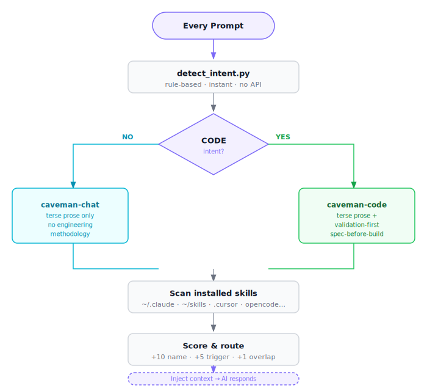

# auto-skill-finder

**Universal AI skill router with dual-mode discipline.** Send a prompt — right skill loads automatically, correct mode activates: **ponytail** for code (lazy senior dev, YAGNI), **caveman** for chat (terse prose). No `/skill` commands. No manual selection. Works with Claude Code, Codex, Cursor, OpenCode, Gemini CLI, and any agent that reads `SKILL.md` or `AGENTS.md`.

Cuts response tokens ~65–75%. Zero accuracy loss. Zero config.

---

## What it does

Every prompt you send:

1. **Detects intent** — code or chat? (rule-based, no API, instant)
2. **Activates mode** — ponytail-code (lazy senior dev, YAGNI) or caveman-chat (terse prose)
3. **Scans** all installed skills across all your AI agents
4. **Scores** each skill against your prompt (name match, trigger keywords, description overlap)
5. **Loads** the best match silently — no announcement, no friction
6. **Compresses** skill content before injecting it (saves input tokens)
7. **Responds** in the active mode

No configuration. No flags. Fires on every message.

---

## Dual-mode: ponytail-code vs caveman-chat

Auto-detects which mode to use based on your prompt. No manual switching needed.

### ponytail-code (auto-activates for code tasks)

Lazy senior developer discipline — [ponytail](https://github.com/DietrichGebert/ponytail). The best code is the code never written:

```
Prompt: "fix the auth bug in my middleware"

→ Climbs the YAGNI ladder: reuse codebase → stdlib → native platform → installed dep → one line
→ Fixes root cause, not symptom — one guard in the shared function, not one per caller
→ Shortest working diff — after understanding the problem fully
→ No unrequested abstractions, no scaffolding "for later"
→ Output: code first, then max 3 lines (what skipped, when to add)
```

Triggers: fix, debug, implement, build, refactor, write code, error, bug, stacktrace, migration, API, endpoint, test, deploy…

### caveman-chat (auto-activates for everything else)

Terse prose only. No engineering overhead.

```
Prompt: "explain how JWT works"

→ Drops articles, filler, pleasantries, hedging
→ Fragments OK. Short synonyms.
→ Full sentences when needed for clarity
→ Intensity: lite / full (default) / ultra
```

Triggers: explain, what is, how does, summarize, compare, tell me, plan, strategy…

### Detection logic



Code signals: file extensions, code blocks (```), error messages, stack traces, verbs like fix/debug/implement/refactor.
Chat signals: "explain", "what is", "how does", "summarize", question phrases.

Turn off: `stop ponytail` / `stop caveman` or `normal mode`.

---

## Token savings

| Source | Reduction |
|--------|-----------|
| Route to 1 skill vs loading all | ~95% of skill context skipped |
| Inline prose compression (no API) | ~10–50% off injected skill content |
| Caveman response mode | ~65–75% off AI responses |

---

## Install

### One-liner (recommended)

**macOS / Linux / WSL / Git Bash:**
```bash
curl -fsSL https://raw.githubusercontent.com/prantikmedhi/auto-skill-finder/main/install.sh | bash
```

**Windows (PowerShell 5.1+):**
```powershell
irm https://raw.githubusercontent.com/prantikmedhi/auto-skill-finder/main/install.ps1 | iex
```

Clones to `~/.auto-skill-finder`, auto-detects installed agents, wires hooks. Takes effect next session.

### Install for one agent only

```bash
# bash
AUTO_SKILL_ONLY=claude curl -fsSL https://raw.githubusercontent.com/prantikmedhi/auto-skill-finder/main/install.sh | bash

# PowerShell
$env:AUTO_SKILL_ONLY="claude"; irm https://raw.githubusercontent.com/prantikmedhi/auto-skill-finder/main/install.ps1 | iex
```

Supported values: `claude`, `cursor`, `gemini`, `opencode`, `codex`, `cline`.

### Update existing install

```bash
AUTO_SKILL_UPDATE=1 curl -fsSL https://raw.githubusercontent.com/prantikmedhi/auto-skill-finder/main/install.sh | bash
```

### Manual (any agent)

Copy `SKILL.md` content into your agent's system prompt, rules file, or instructions. Copy `AGENTS.md` for agents that auto-discover it (OpenCode, Copilot).

---

## No slash commands needed

After install, **just talk normally.** The AI agent finds and loads the right skill by itself — and picks the right mode.

```
❌ Old way:  /github-pr review this diff
✅ New way:  review my pull request          → ponytail-code activates

❌ Old way:  /docker-compose generate postgres setup
✅ New way:  set up postgres with docker     → ponytail-code activates

❌ Old way:  /stripe-integration add subscription billing
✅ New way:  add stripe subscription to my app  → ponytail-code activates

❌ Old way:  /jest write unit tests for this function
✅ New way:  write unit tests for this function  → ponytail-code activates

❌ Old way:  /sql-optimizer fix this slow query
✅ New way:  this query is slow, fix it      → ponytail-code activates

❌ Old way:  /linear create a bug ticket
✅ New way:  create a bug ticket for this issue  → caveman-chat activates
```

No `/commands`. No memorizing skill names. No manual invocation.
Router scores every installed skill against your prompt, picks the winner, activates the right mode — all silently.
If no skill matches, agent answers normally — no errors, no interruption.

---

## How skill routing works

Scoring (max 22 points per skill):

| Points | Condition |
|--------|-----------|
| +10 | Prompt names the skill explicitly |
| +5 each (max 15) | Trigger keyword match |
| +1 each (max 7) | Description word overlap |

Thresholds:
- **≥ 12** → auto-execute, no announcement
- **5–11** → load skill, one-line note
- **< 4** → fallback to general AI behavior

Skills discovered from: `~/.claude/skills/`, `~/.claude/plugins/`, `~/.cursor/skills/`, `~/.config/opencode/skills/`, `~/skills/`, current directory.

---

## Build skill index (optional, faster routing)

Pre-index all your skills for instant lookup:

```bash
python3 scripts/build_index.py
# writes ~/.claude/auto-skill-index.json
```

Re-run after installing new skills.

---

## Compress files with caveman (full LLM compression)

For compressing large markdown files (CLAUDE.md, todo lists, memory files) using Claude API:

```bash
python3 scripts/cli.py path/to/file.md
```

- Compresses natural language prose into caveman format
- Preserves all code blocks, URLs, headings exactly
- Saves original backup to `~/.local/share/caveman-compress/backups/`
- Validates output before writing (auto-retries up to 2x)

Requires `ANTHROPIC_API_KEY` or `claude` CLI in PATH.

---

## Scripts reference

| Script | Purpose | API needed |
|--------|---------|------------|
| `scripts/skill_finder.py` | Core routing engine | No |
| `scripts/detect_intent.py` | Code vs chat classifier (per-prompt) | No |
| `scripts/inline_compress.py` | Rule-based prose compression (runs in hook) | No |
| `scripts/prompt_analyzer.py` | Intent and entity extraction | No |
| `scripts/build_index.py` | Build searchable skill index cache | No |
| `scripts/detect.py` | Classify file as natural language vs code | No |
| `scripts/validate.py` | Verify compression preserved structure | No |
| `scripts/compress.py` | Full LLM-based caveman compression | Yes (Claude) |
| `scripts/cli.py` | CLI for compress.py | Yes (Claude) |

---

## Modes

Always active. Two modes, auto-selected per prompt.

**caveman-chat** (explanations, Q&A, planning):
```
Not: "Sure! I'd be happy to help you with that..."
Yes: "JWT = signed token. Header.Payload.Signature. Server verify signature, no DB lookup needed."
```

**ponytail-code** (code tasks):
```
Not: writes a cache class with factory, interface, and config file
Yes: "@lru_cache(maxsize=1000) on the fetch function. Skipped custom
     cache class, add when lru_cache measurably falls short."
```

Turn off: `stop ponytail` / `stop caveman` or `normal mode`.
Intensity (chat): `caveman lite`, `caveman ultra`.

---

## Supported agents

| Agent | Mechanism | Auto-activates |
|-------|-----------|----------------|
| Claude Code | Hooks + skill | Yes |
| Cursor | `.cursor/rules/` MDC file | Yes |
| Gemini CLI | Extension via `gemini-extension.json` | Yes |
| OpenCode | `AGENTS.md` auto-discovery | Yes |
| Codex | `~/.codex/system-prompt.md` append | Yes |
| Cline | `.clinerules/` file | Yes |
| Copilot | `AGENTS.md` at repo root | Yes |
| Others | Paste `SKILL.md` into system prompt | Manual |

---

## File structure

```
auto-skill-finder/
├── SKILL.md              ← AI routing instructions (single source of truth)
├── AGENTS.md             ← OpenCode / Copilot / Cursor auto-discovery
├── GEMINI.md             ← Gemini CLI extension context
├── CLAUDE.md             ← Claude Code project rules
├── gemini-extension.json ← Gemini extension manifest
├── package.json
├── install.sh            ← Shell installer shim
├── bin/
│   └── install.js        ← Multi-agent installer
├── hooks/
│   ├── SessionStart.js       ← Caveman flag + system context
│   └── UserPromptSubmit.js   ← Per-prompt routing + mode detection
├── skills/
│   ├── ponytail-code/SKILL.md ← Code mode: lazy senior dev, YAGNI ladder
│   └── caveman-chat/SKILL.md  ← Chat mode: terse prose only
├── config/
│   └── agent-paths.json  ← Agent-specific skill dir config
└── scripts/
    ├── skill_finder.py       ← Core discovery engine
    ├── detect_intent.py      ← Code vs chat classifier
    ├── inline_compress.py    ← Rule-based compressor (no API)
    ├── prompt_analyzer.py    ← Intent extraction
    ├── build_index.py        ← Skill index cache
    ├── detect.py             ← File type detection
    ├── validate.py           ← Compression validator
    ├── compress.py           ← LLM-based caveman compressor
    └── cli.py                ← CLI entry point
```

---

## Requirements

- Node.js ≥ 18 (for installer and hooks)
- Python 3.10+ (for routing scripts)
- Claude Code, Cursor, Gemini CLI, OpenCode, or Codex installed

For LLM-based file compression: `ANTHROPIC_API_KEY` or `claude` CLI authenticated.

---

## Uninstall

```bash
node bin/install.js --uninstall
```

Removes hooks from `~/.claude/settings.json` and deletes hook files.

---

## License

MIT
